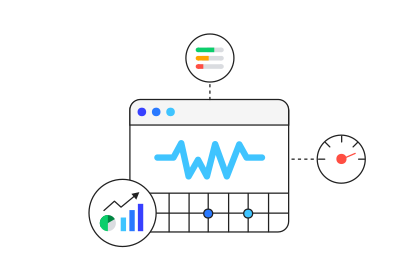

<p align="center">
  
</p>

<h1 align="center">
  eo-logger
</h1>

<p align="center">
  Isomorphic logger based on Elastic Common Schema
</p>

## ✨ Features:
- Tiny <1KB size gzip
- Works in Node.js and in Browser
- Built-in Typescript support

## How to install

```bash
yarn add eo-logger
```

Or

```bash
npm install eo-logger --save
```

## How to use in browser

For start using required to create instance of class `Logger`

```ts
import { Logger } from 'eo-logger/dist/client/logger';

export const logger = new Logger();
```

Now you can import logger in any place of your application and use one of next methods

`logger.error` - for errors

`logger.debug` - for debug some information

`logger.warning` - for warnings

`logger.collectMetrics` - for collect performance metrics of your web application (this method available only for client logger)

By default logger transport just display `ECS.Message` in console.
If you want to collect logs, you have to implement your own `Transport` class.
Actually it is quite simple, look at example below:

```ts
import { ECS, Transport } from 'eo-logger';
import { Logger } from 'eo-logger/dist/client/logger';

class MyTransport extends Transport {
  public send(message: ECS.Message): void {
    fetch('/frontend-logs', {
      method: 'post',
      body: JSON.stringify(message),
    });
  }
}

export const logger = new Logger({
  transport: new MyTransport(),
});
```

## How to use with express

1. Create api endpoint for collect logs

```ts
import * as express from 'express';

const app = express();
app.use(express.json());

app.post('/frontend-logs', (req, res) => {
  return res.status(200).send();
});
```

2. Add `@elastic/elasticsearch`

```bash
yarn add @elastic/elasticsearch
```

3. Create elasticsearch client and transport instance

```ts
import * as express from 'express';
import { Client } from '@elastic/elasticsearch';
import { Transport as ElkTransport } from 'eo-logger/dist/server/logger';

const app = express();
app.use(express.json());

app.post('/frontend-logs', (req, res) => {
  elkTransport.send(req.body);

  return res.status(200).send();
});

const elasticClient = new Client({ node: 'http://localhost:9200' });

const elkTransport = new ElkTransport({
  client: elasticClient,
  indexBase: 'frontend-logs',
  maxQueueSize: 5,
});
```

## Advanced

Logger contains 3 main components:
* Context
* Transport
* Formatter

## Client utilities

`getPerformanceMetrics` - function returns object with performance metrics of page speed loading

## Server utilities

`parseUserAgent` - function returns `ECS.UserAgent` object with information based on `user-agent` string

`parseGeo` - function return `ECS.Geo` object with information based on ip string
